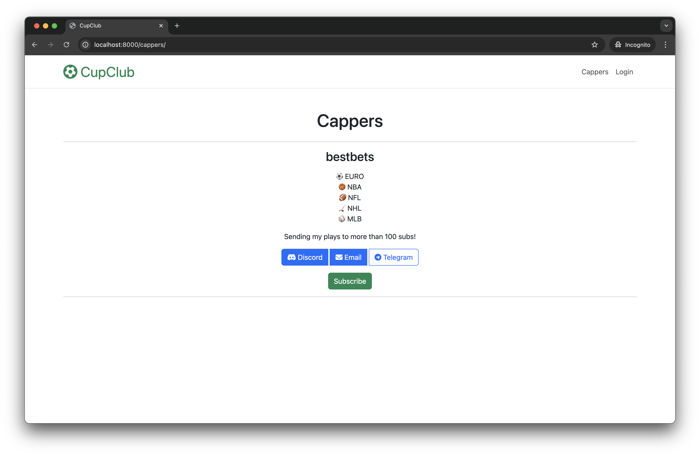
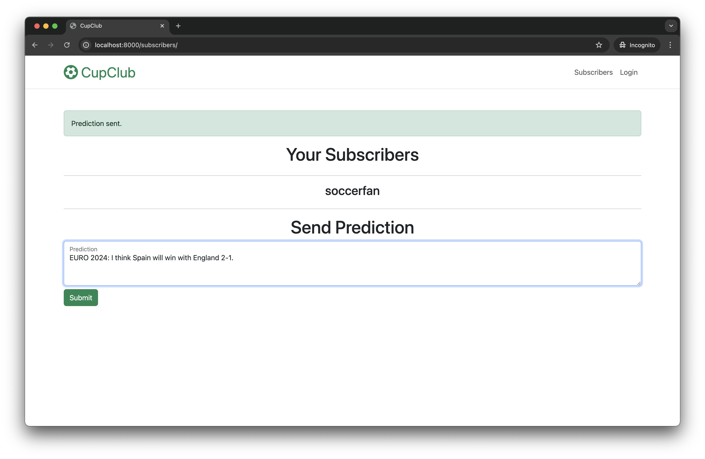
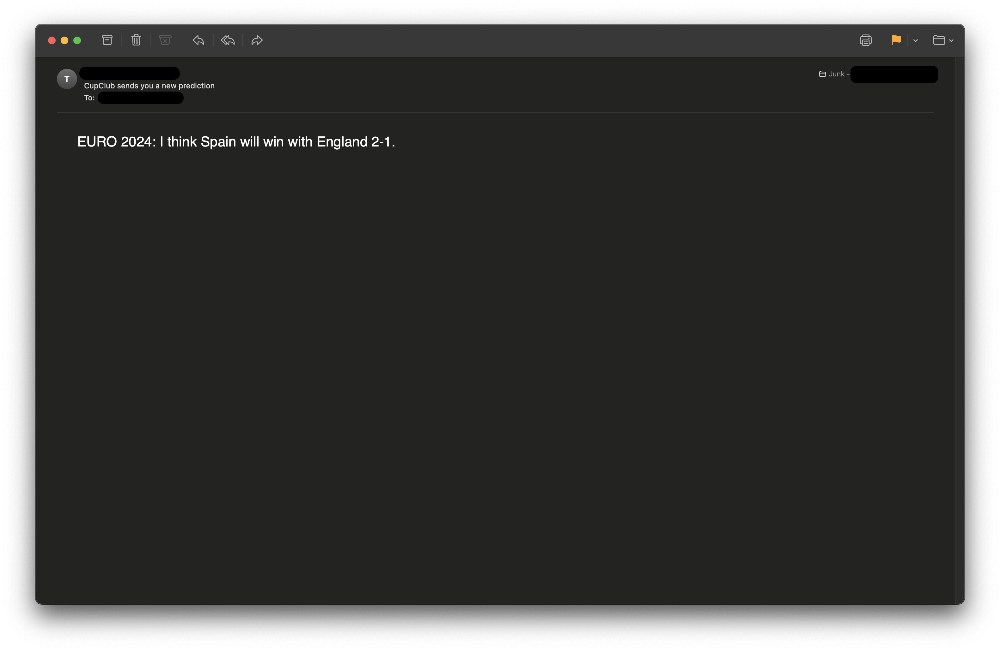

# CupClub

## Development

1. Install [`uv`](https://github.com/astral-sh/uv).

    ```sh
    pipx install uv
    ```

1. Create virtual environment.

    ```sh
    uv venv
    ```

1. Install development dependencies.

    ```sh
    uv pip sync requirements/dev.txt
    ```

## Local Environment

1. Create and fill `.env` file in the root project directory.

    ```
    POSTGRES_DB=cupclub
    POSTGRES_USER=postgres
    POSTGRES_PASSWORD=postgres
    POSTGRES_HOST=db
    POSTGRES_PORT=5432
    SECRET_KEY=secret
    CELERY_BROKER_URL=rabbit
    CELERY_RESULT_BACKEND=rpc://
    AWS_ACCESS_KEY_ID=your-access-key-id
    AWS_SECRET_ACCESS_KEY=your-secret-access-key
    AWS_SES_REGION_NAME=your-aws-region-name
    FROM_EMAIL=your-sender-email
    ```

1. Start Docker Compose services.

    ```sh
    docker compose up
    ```

1. Access the application at [`localhost:8000`](http://localhost:8000).


## Trade-Offs

While aspects like code quality, adherence to best practices, and unit tests are essential in software engineering, for a product built for demo purposes, they are less relevant as they do not contribute visible value to stakeholders. The focus was on delivering a functional and demonstrable MVP within the limited time frame, showcasing core features to potential investors.

Besides obvious production-readiness aspects, some of compromises made to prioritize functionality and speed are listed above:

- **Testing**: No unit or integration tests were implemented, which is a critical aspect for ensuring code reliability and facilitating future development. However, they bring no value for the initial investing decision.
- **Code Quality**: Numerous shortcuts were taken, resulting in deviations from SOLID principles and general best practices. This includes mixed levels of abstraction, or even total lack of abstraction, and tight coupling between components.
- **User Experience**: The user experience is basic, with minimal validation checks and error handling, which can lead to a poor interaction with the application.
- **Templates and Views**: Django templates were used for simplicity, which might not be the best choice for larger, more complex applications, but
are good enough for quick prototypes. This, together with time constraints, led to suboptimal view organization, unclear responsibility separation,
which affect maintainability, and general code quality.
- **Code Quality Tools**: Proper linting and static analysis tools were not implemented, which are crucial for maintaining code quality and consistency.
- **Local Setup**: The current application setup is suitable only for running in local environment. Adjustments are required to make the app deployable to cloud servers, such as configuring environment variables, setting up cloud-specific infrastructure, and ensuring proper security measures.
- **Continuous Integration**: The current setup does not include a continuous integration (CI) system. 
- **Logging**: The initial build lacks any logging. 


## Screenshots

### Subscriber's View



### Capper's View



### Received Prediction


